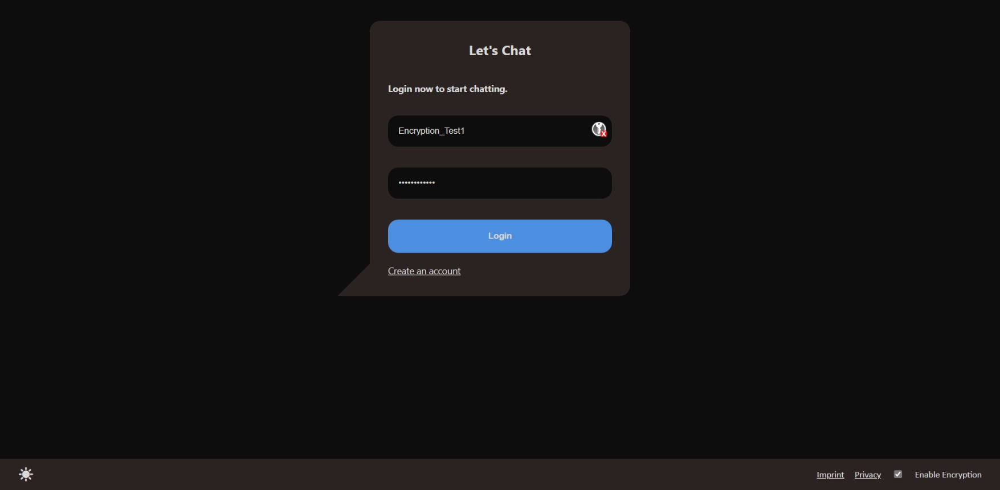
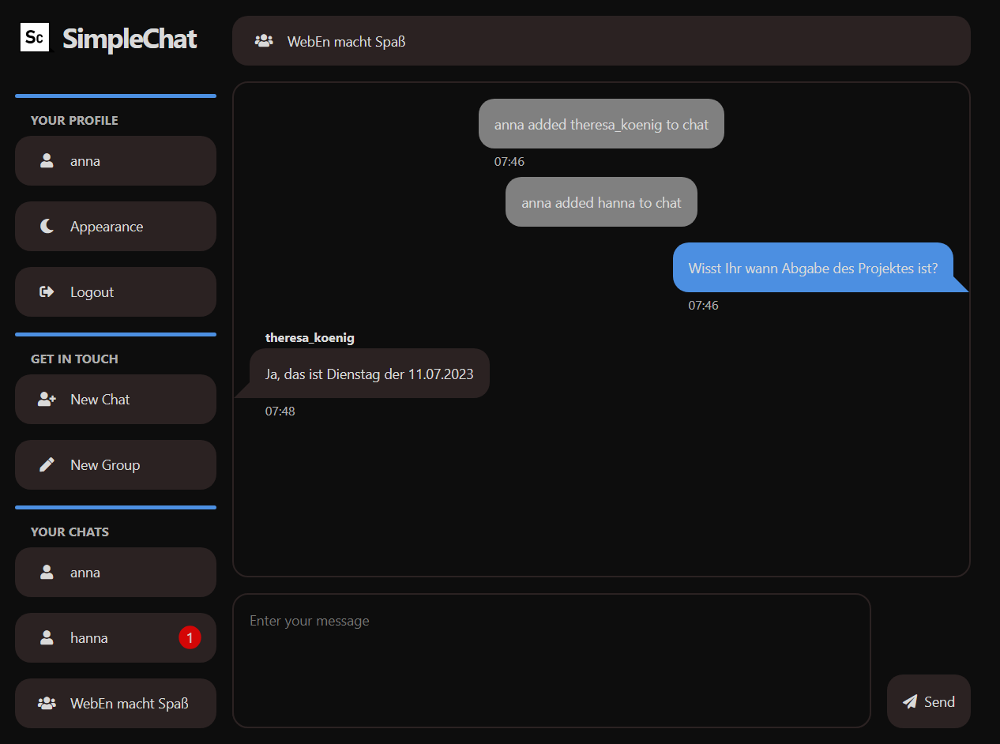
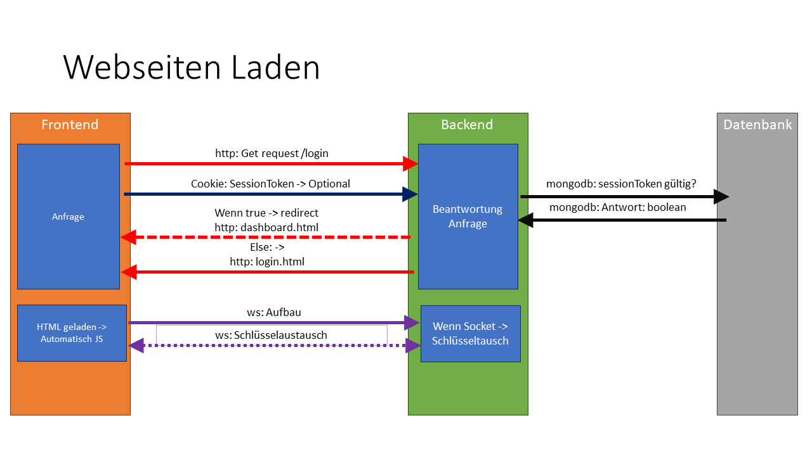
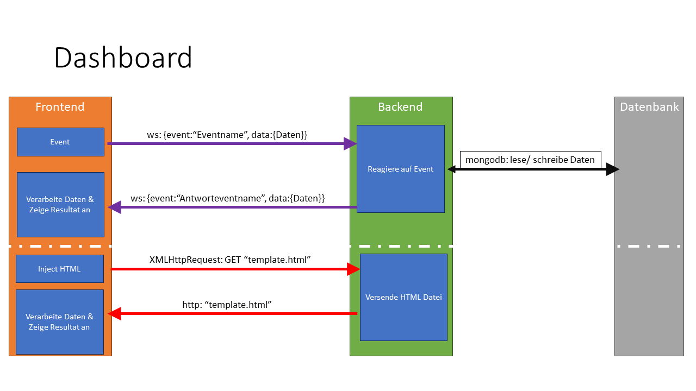

# Technische Dokumentation
## Einleitung
Die Funktion dieser Dokumentation besteht darin, den Quellcode der SimpleChat App verständlich zu machen. Es handelt sich hierbei um zwei wesentliche Komponenten: Das Backend und das Frontend. Um das Projekt lokal zu testen, führen Sie bitte "npm i" aus, um alle notwendigen Pakete aus der `package.json` zu installieren. Die SimpleChat App verwendet die MongoDB, die ebenfalls installiert werden muss. Sobald die Datenbankt betriebsbereit ist, kann die Anwendung gestartet werden. Verwenden Sie dafür im tiefsten Pfad der Baumstruktur den Befehl `npm start`. In der `package.json` haben wir das <em>start-Skript</em> angelegt, so dass Nodemon unsere JavaScript-Datei ausführt.

## Struktur der Website
### Login

Die Startseite ist die Login-Seite, von der man ohne Registrierungsdaten auf das Impressum, die Registrierungs- und die Datenschutzseite navigieren kann. Falls sich ein Nutzer innerhalb einer bestimmten Zeit bereits angemeldet hat und der Nutzer noch einen gültigen Sessiontoken als Cookie besitzt, wird dieser automatisch auf die Dashboard-Seite weitergeleitet. Andernfalls muss der Nutzer sich anmelden, oder wenn noch nicht bereits geschehen, neu registrieren.

### Dashboard

Die Dashboard-Seite ist zweigeteilt. Auf der linken Seite befindet sich eine Navigationsleite und auf der rechten Seite der geladene Inhalt.
Für das responsive Design, wird bei unterschreitung einer bestimmten Bildschirmgröße die Navigationsleiste automatisch eingeklappt und kann über ein entsprechendes Symbol in der Kopfzeile des geladenen Inhalts ausgeklappt werden.
In der Navigationsleiste gibt es drei Abschnitte: Profil, Erstellungsmöglichkeiten und Chats/Gruppen.

Die **Profilansicht** ermöglicht das Ändern des Passwortes, sowie des Löschen des Accounts.
In den **Erstellungsmöglichkeiten** können neue Einzelchats gestartet und Gruppen erstellt werden.
Das Hinzufügen der Gruppenmitlieder erfolgt in den Gruppeneinstellung der jeweiligen Gruppe.
Die **Chatübersicht** bietet ein Überblick über alle Chats und Gruppen.
Bei einem Klick auf den Chat oder Gruppe wird der bisherige Verlauf angezeigt. Hierbei werden die eigenenen Nachrichten auf der rechten Seite hervorgehoben. Unterhalb des Verlaufs befindet sich die Texteingabe zum Versenden neuer Nachrichten.

## Technische Umsetzung
### Backend

---
#### Grundstruktur
Das Backend unserer Simple Chat App befindet sich im Ordner "Server". In diesem Ordner sind vier Javascript-Dateien zu finden. Die Datei `server.js` ist die Javascript-Datei, die das Projekt initiiert. Sie beinhaltet den Express-Server mit den entsprechenden Routen (Login, Registrieren, Dashboard) und den WebSocket, der für den Nachrichtenaustausch nach dem Login verantwortlich ist. Um die `server.js` nicht zu überfüllen, haben wir "*eventfunctions*" und *"dbfunctions"* in separate Dateien ausgelagert (`db.js`, `eventFunctions.js`), die exportiert und in der `server.js` importiert werden. So können diese Funktionen auch dann aufgerufen werden, wenn sie in einer anderen Datei implementiert sind. Die Datei `db.js` enthält Methoden, die genutzt werden, um eine Datenbankverbindung zu etablieren und Datenbankabfragen durchzuführen. *"Eventfunctions"* sind Funktionen, die ausgeführt werden, wenn das entsprechende Event getriggert wurde, und es werden dann Datenbankabfragen ausgeführt, mithilfe der *"dbfunctions"* und an den Client gesendet. In der Datei `encryption.js` befinden sich Methoden, die für die Ver- und Entschlüsselung von Daten verwendet werden.

Für HTTP-Anfragen werden drei Middlewares verwendet. Zuerst „express.static“, um einen statischen Zugriff auf Dateien vom Server zu ermöglichen. Mittels „cookieParser“ werden danach die Cookies vom Client geparsed. Diese werden dann in der dritten Middleware verwendet, um die Sessionvalidierung durchzuführen. Sollte die Validierung fehlschlagen, wird der Nutzer auf die Login-Seite weitergeleitet.

Für die Kommunikation zwischen Client und Webserver wird einen WebSocket verwendet.
Die Funktionalität des Websockets wurde durch eine Eventschnittstelle erweitert. Hierbei werden die Nachrichten in ein JSON-Objekt in dem Schema
```
{
  event: "eventsample",
  data: Object
}
```
versendet. Beim Empfangen eines Events wird mittels einer Switch-Verzweigung unser benutzerdefiniertes Event unterschieden und die entsprechende Methode in `eventfunctions.js` aufgerufen. Dasselbe Event-Handling-Prinzip wird ebenfalls im Frontend verwendet.

Die MongoDB ist eine objektorientierte Datenbank. Dies bedeutet das die Datenbank in Collections aufgeteilt ist, in denen einzelne Objekte abgespeichert werden können. Bei diesem Project werden drei Collections verwendet: *user, chatHistory und sessions*. In der User-Collection wird für jeden Nutzer ein Objekt angelegt. In diesem Objekt ist der Nutzername, das Passwort und ein Array von Chat-Objekten gespeichert. Ein Chat-Objekt besteht aus einer ChatID und der Anzahl ungelesener Nachrichten des zugehörigen Chats.
Die chatHistory-Collection speichert die Objekte von Chatverläufen. In einem Chatverlauf-Objekt sind die *ChatID, der Name, der Chat-Typ, die Mitglieder und die Nachrichten-Objekte* hinterlegt. Ein Nachrichten-Objekt besteht aus der *Nachricht, dem Autor, einem Zeitstempel und einer Lesebestätigung*. 
In der Session-Collection werden Session-Objekte gespeichert, welche aus dem Nutzernamen, so wie einem Sessiontoken besteht.

### Frontend

---
Im Frontend sind die HTML Dateien in Hauptdateien und in Templates aufgeteilt. Die Templates werden bei Bedarf geladen und in die Seite eingefügt.
Die HTML-Dateien liegen in dem Ordner subpages, die templates liegen im dem Unterordner dashboard.
Für den Stil liegen die Cascading Style Sheets und die Bilder in dem Ordner style. Die JavaScript Dateien für das Frontend liegen in dem Ordner script.

Über die Websocketverbindung werde, wie im Backend näher beschrieben, sämltliche Events als bestimtes Datenpacket versendet und die Antwort erhalten.
Je nach Event werden im Frontend die entsprechenden Funktionen ausgeführt.

#### Anmeldung
Wenn ein Nutzer die Seite betritt, wird er auf die Seite login.html weitergeleitet. Dort kann dieser in der Fußleiste das Impressum und die Dateschutzerklärung einsehen. Außerdem kann der Nutzer das Farbschema manuell umschalten.

#### Farbschema
Das Farbschema wird automatisch nach den Benutzerpräferenzen geladen.
Das präferierte Farbschema wird im lokalen Speicher zwischengespeichert.
Falls ein Schema nicht zur Verfügung steht, wird dieses automatisch aus dem präferierten Schema geladen.

#### Registrierung/Login/Passwortwechsel
Bei der Registrierung werden der Nutzername und das Passwort abgefragt. Bevor die Anfrage zum Server geschickt wird, werden die Eingaben vom Nutzer auf die Zeichenvorgaben geprüft.
Der Nutzername darf hierbei nur Römische Buchstaben, arabische Ziffern und die Zeichen "+-_" enthalten.
Das Passwort muss aus mindestens 8 Zeichen bestehen, wovon mindestens ein Kleinbuchstabe, ein Großbuchstabe, einer Zahl und einem Sonderzeichen bestehen muss.
Falls bei einer Überprüfung ein Fehler auftritt wird dieses in einem Text angezeigt.

#### Dashboard

Wenn das Dashboard geladen wird, fordert dieses die Daten des eingeloggten Nutzers bei dem Server an.
Sobald die Daten vorliegen, wird die Chatübersicht dynamisch mit JavaScript erzeugt und in die Seitenleiste eingefügt.
Die Hauptseite wird als Template vom Server geladen und als HTML in die Seite eingefügt.

Da die Templates nur in die Seite eingefügt werden, enthalten diese kein gültigen HTML-Seiten Aufbau.

#### Chats
Sobald ein Chat geladen wird, wird das dem Chattyp entsprechende Template geladen und die Nachrichten zum Chat angefragt. Sobald die Daten vorliegen werden die Daten je nach Nachrichtentyp zusammengebaut und der gesamte template Chat ersetzt.
Wenn Nachrichten nachgeladen werden, oder eine Mitteilung einer neuen Nachricht kommt, werden die neuen Nachrichten in den Chat eingefügt, wenn der Chat der Nachrichten mit dem geladenen Chat übereinstimmt.

#### Medien/Sondernachrichten
Prinzipiell untestützt der Messenger das Empfangen und versenden von Medien. 
Dieses Feature ist experimentell und daher noch nicht für den Nutzer aus dem Dashboard aufrufbar. 
Zum Versenden der Medien werden diese in `base64` umcodiert und der jeweilige Typ der Medien an das zu übertragende Objekt angehängt.
Beim Anzeigen der Nachricht wird der Typ abgefragt und dementsprechend unterschieden.

Informationsnachrichten werden vom Server auf bestimmte Events erstellt. Diese erhalten den Typ `Info`.

#### Erstellen neuer Chats/Gruppen
Wenn ein neuer Chat erstellt werden soll, wird das jeweilige Template des Chats oder der Gruppe vom Server angefragt und in das Hauptfenster eingefügt.

Bei einem neuen Chat wird der Nutzer gebeten den Nutzername der jeweilig anderen Person einzugeben.
Bei einer Gruppe wird der Nutzer gebeten einen Gruppennamen einzugeben.
Wenn der Server zuückmeldet, dass dieser Nutzer existiert und bislang noch kein Chat mit dieser Person erstellt wurde, wird der Chat in das Seitenmenu eingefügt und der Chat geladen.
Eine Gruppe kann jederzeit erstellt werden.

#### Chat/Gruppenübersicht
Eine Chat besitzt eine Übersicht durch die nähere Informationen zum Chat ersichtlich sind.
In dieser Übersicht kann die Gruppe/Chat verlassen werden. In einer Gruppe können zusätzlich Nutzer hinzugefügt und entfernt werden, sowie der Gruppenname geändert werden.

Wenn ein Event in der Gruppe stattfindet z.B. der Gruppenname geändert wird oder jemand die Gruppe verlässt, wird vom Server eine Infonachricht an alle Mitglieder versendet. Diese Informationsnachticht wird im Chat gesondert hervorgehoben. 

#### Verlust der Websocket-Verbindung
Wenn der Websocket im Dashboard die Verbindung beendet erscheint ein Overlay mit der Mitteilung, dass der Websocket die Verbindeung verloren hätte.
Nach einem Timeout wird automatisch versucht die Verbindung wieder aufzubauen.

#### Abmelden
Meldet sich ein Nutzer ab, wird die Sitzung beendet, die Sessioncookies vom Servergelöscht sowie lokal den Sessionstorage und die Cookies.
Der Nutzer wird bei erfolgreicher Abmeldung auf die loginseite weitergeleitet.


## Weitere Informationen
### Sicherheit
Auf die einzelnen HTML-Dokumente kann zugegriffen werden, da die Nutzerdaten jedoch vom Server angefordert werden müssen, wofür dieser ein Login benötigt, ist dieses vorgehen vertretbar. Es sind somit keine persönlichen Informationen ohne login anfragbar.

### Tokens
Passwörter werden in der Datenbank nur in gehashter Form mit einem Salz gespeichert.
Das Passwort wird mit dem auf dem Server generierten und gespeicherten Salz gehasht. Bei einer Anmeldung werden die Hashs verglichen, somit ist das Passwort nicht mehr in einer angemessenen Zeit aus der Datenbank auslesbar.
Damit das Passwort nur einmal übertragen werden muss, generiert der Server einen zufällig generierten einzigartigen Token, mit dem sich der Nutzer anmelden kann. Dieser Token wird bei jeder Anfrage verschickt und abgeprüft.
Der Token wird bei einer Abmeldung automatisch gelöscht und bei jeder Anmeldung neu generiert. Zusätzlich verfällt der Cookie automatisch nach einer gesetzen Zeit.
Der Einsatz von Token ermöglicht es das Passwort nicht unverschlüsselt zwischenspeichern zu müssen sondern befindet sich nur im Rahmen eines Logins, der erstellen eines Accounts oder bei dem Ändern des Passwortes im Frontend und Backend.

### Übertragungsverschlüsselung
Damit Passwörter nicht unverschlüsselt versendet werden müssen, wurde eine Verschlüsselung des Datenstroms eingebaut.
Diese Verschlüsselung ist jedoch eine Client-Server bzw. Server-Client verschlüsselung mit einem symmetrischen Schlüssel.
Für eine übliche Ende-zu-Ende Verschlüsselung ist bislang keine sinnvolle Strategie entstanden, daher ist diese nicht implementiert.
Die genutzte Verschlüsselung wird, wenn das System oder der Nutzer das Feature nicht ausschaltet, erzeugt, und wird für jeden Socket individuell erstellt.
Dennoch ist dieses Feature nur unzureichend gegen Angriffe sicher, da die Daten auf der Datenbank unverschlüsselt eingelesen werden können und Angriffe auf die Sandbox des Users das den Schlüssel und andere Daten extrahieren können.

## Anhang




